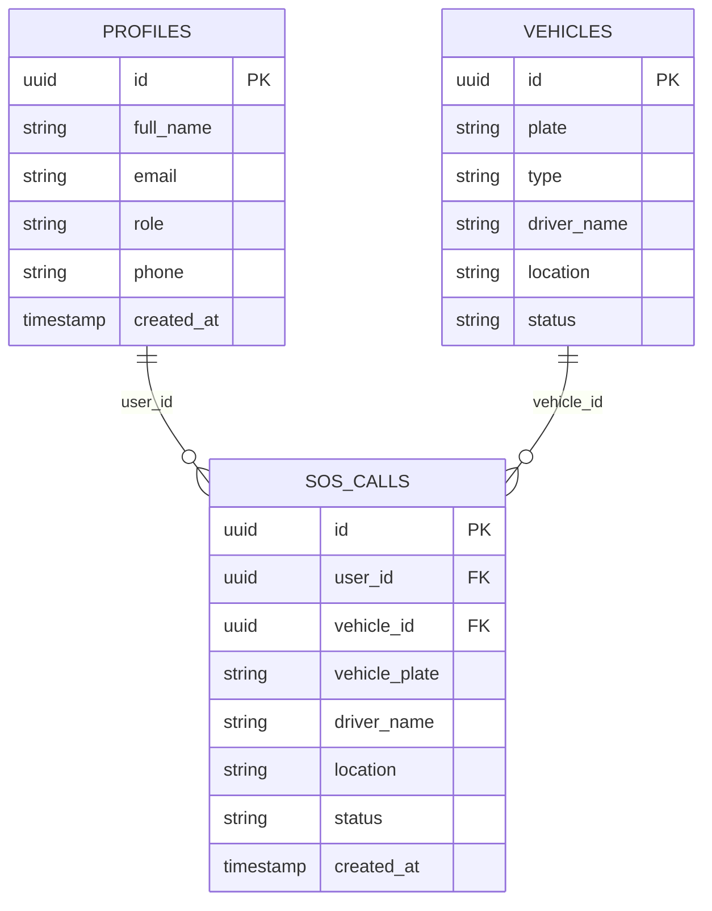
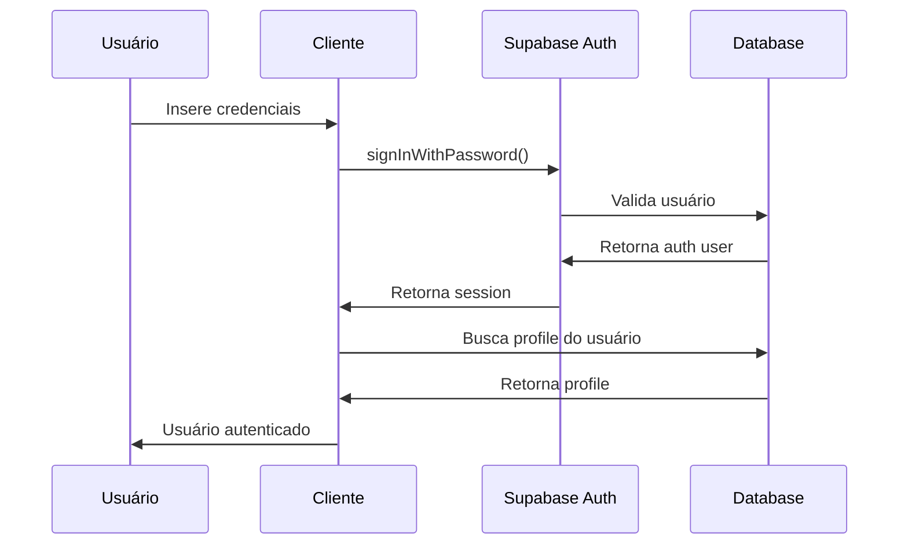

# Documentação Técnica - Sistema SOS

## 🏗️ Arquitetura da Aplicação

### Padrões Arquiteturais

O sistema segue os seguintes padrões:

- **Clean Architecture**: Separação clara entre camadas de UI, domínio e infraestrutura
- **Component Composition**: Composição de componentes React reutilizáveis
- **Custom Hooks**: Encapsulamento de lógica de negócio em hooks personalizados
- **Repository Pattern**: Abstração das operações de banco via TanStack Query

### Stack Tecnológica

```
┌─────────────────┐
│   React + TS    │  ← Interface do Usuário
├─────────────────┤
│ TanStack Query  │  ← Gerenciamento de Estado
├─────────────────┤
│  Supabase SDK   │  ← Cliente de Dados
├─────────────────┤
│   PostgreSQL    │  ← Banco de Dados
└─────────────────┘
```

## 📊 Estrutura de Dados

### Relacionamentos das Tabelas



### Enums do Sistema

```sql
-- Roles de usuário
CREATE TYPE user_role AS ENUM ('admin', 'trafego', 'mecanico');

-- Status dos chamados SOS
CREATE TYPE sos_status AS ENUM ('waiting', 'in-progress', 'completed', 'overdue');

-- Tipos de veículos
CREATE TYPE vehicle_type AS ENUM ('Truck', 'Super Toco', 'Agilix', 'Triciclo');
```

## 🔐 Sistema de Autenticação

### Fluxo de Autenticação



### Row Level Security (RLS)

```sql
-- Exemplo de política RLS para profiles
CREATE POLICY "Users can view own profile" ON profiles
  FOR SELECT USING (auth.uid() = id);

CREATE POLICY "Admins can view all profiles" ON profiles
  FOR SELECT USING (is_admin(auth.uid()));
```

## 🎯 Componentes e Hooks

### Hierarquia de Componentes

```
App
├── QueryClientProvider
├── TooltipProvider
├── BrowserRouter
│   ├── ProtectedRoute
│   │   ├── AppLayout
│   │   │   ├── AppSidebar
│   │   │   ├── AppHeader
│   │   │   ├── Pages (Dashboard, NovoSOS, etc.)
│   │   │   └── Footer
│   │   └── Toasters
│   └── PublicRoute
│       └── Login
```

### Hooks Personalizados

#### `useAuth`
- **Responsabilidade**: Gerenciar estado de autenticação
- **Estado**: `user`, `loading`
- **Ações**: `signIn`, `signOut`

#### `useSOSCalls`
- **Responsabilidade**: Operações CRUD de chamados SOS
- **Estado**: `sosCalls`, `isLoading`, `error`
- **Ações**: `createSOSCall`, `updateSOSCall`

#### `useVehicles`
- **Responsabilidade**: Operações CRUD de veículos
- **Estado**: `vehicles`, `isLoading`, `error`
- **Ações**: `createVehicle`, `updateVehicle`, `deleteVehicle`

## 🚦 Gerenciamento de Estado

### TanStack Query

```typescript
// Configuração padrão do QueryClient
const queryClient = new QueryClient({
  defaultOptions: {
    queries: {
      staleTime: 1000 * 60 * 5, // 5 minutos
      cacheTime: 1000 * 60 * 10, // 10 minutos
    },
  },
});
```

### Query Keys

```typescript
// Padrão de naming para query keys
const QUERY_KEYS = {
  sosCalls: ['sos_calls'],
  vehicles: ['vehicles'],
  users: ['users'],
  userProfile: (id: string) => ['user', id],
} as const;
```

## 🎨 Design System

### Tokens de Design

```css
/* src/index.css */
:root {
  /* Colors - HSL values */
  --sotero-blue: 212 72% 59%;
  --sotero-blue-light: 213 60% 75%;
  
  /* Status Colors */
  --status-success: 142 76% 36%;
  --status-warning: 48 96% 53%;
  --status-danger: 0 84% 60%;
  --status-info: 199 89% 48%;
}
```

### Componentes UI

- **Base**: Shadcn/ui components
- **Customização**: Variants usando `cva` (class-variance-authority)
- **Estilização**: Tailwind CSS com tokens semânticos

## 📱 Responsividade

### Breakpoints

```typescript
// tailwind.config.ts
const breakpoints = {
  sm: '640px',
  md: '768px',
  lg: '1024px',
  xl: '1280px',
  '2xl': '1536px',
};
```

### Sidebar Responsiva

```typescript
// Hook para detecção mobile
export function useIsMobile() {
  const [isMobile, setIsMobile] = useState(false);
  
  useEffect(() => {
    const mql = window.matchMedia('(max-width: 767px)');
    const onChange = () => setIsMobile(window.innerWidth < 768);
    
    mql.addEventListener('change', onChange);
    setIsMobile(window.innerWidth < 768);
    
    return () => mql.removeEventListener('change', onChange);
  }, []);
  
  return isMobile;
}
```

## 🔍 Debugging e Logs

### Console Logs Estruturados

```typescript
// Padrão para logs no useAuth
console.log('useAuth: Iniciando verificação de autenticação');
console.log('useAuth: Sessão inicial:', session ? 'Existe' : 'Não existe');
console.error('useAuth: Erro ao obter sessão:', error);
```

### Error Boundaries

```typescript
// Componente ErrorMessage para tratamento de erros
interface ErrorMessageProps {
  title: string;
  message: string;
  className?: string;
}

export const ErrorMessage = ({ title, message, className }: ErrorMessageProps) => (
  <Alert variant="destructive" className={className}>
    <AlertCircle className="h-4 w-4" />
    <AlertTitle>{title}</AlertTitle>
    <AlertDescription>{message}</AlertDescription>
  </Alert>
);
```

## ⚡ Performance

### Otimizações Implementadas

1. **Lazy Loading**: Componentes carregados sob demanda
2. **Query Caching**: Cache automático via TanStack Query
3. **Memoization**: Uso de `useCallback` e `useMemo` quando necessário
4. **Bundle Splitting**: Separação automática via Vite

### Métricas de Performance

```javascript
// Medição de Core Web Vitals
const observer = new PerformanceObserver((list) => {
  for (const entry of list.getEntries()) {
    if (entry.entryType === 'largest-contentful-paint') {
      console.log('LCP:', entry.startTime);
    }
  }
});

observer.observe({ entryTypes: ['largest-contentful-paint'] });
```

## 🧪 Testes (Recomendações)

### Estrutura de Testes

```
tests/
├── __mocks__/
│   ├── supabase.ts
│   └── react-router-dom.ts
├── components/
│   ├── SOSCard.test.tsx
│   └── AppSidebar.test.tsx
├── hooks/
│   ├── useAuth.test.ts
│   └── useSOSCalls.test.ts
└── pages/
    ├── Dashboard.test.tsx
    └── Login.test.tsx
```

### Setup de Testes

```typescript
// jest.setup.ts
import '@testing-library/jest-dom';
import { server } from './src/__mocks__/server';

beforeAll(() => server.listen());
afterEach(() => server.resetHandlers());
afterAll(() => server.close());
```

## 🚀 Deploy e CI/CD

### Variáveis de Ambiente

```env
# .env.local
VITE_SUPABASE_URL=your_supabase_url
VITE_SUPABASE_ANON_KEY=your_supabase_anon_key
```

### Build Process

```bash
# Build de produção
npm run build

# Preview local
npm run preview

# Análise do bundle
npm run analyze
```

## 🛠️ Ferramentas de Desenvolvimento

### VS Code Extensions Recomendadas

```json
{
  "recommendations": [
    "bradlc.vscode-tailwindcss",
    "esbenp.prettier-vscode",
    "ms-vscode.vscode-typescript-next",
    "formulahendry.auto-rename-tag",
    "christian-kohler.path-intellisense"
  ]
}
```

### Scripts NPM

```json
{
  "scripts": {
    "dev": "vite",
    "build": "tsc && vite build",
    "preview": "vite preview",
    "lint": "eslint . --ext ts,tsx --report-unused-disable-directives --max-warnings 0",
    "test": "jest",
    "test:watch": "jest --watch",
    "test:coverage": "jest --coverage"
  }
}
```

## 📚 Referências e Documentação

### Links Úteis

- [React Documentation](https://react.dev/)
- [TypeScript Handbook](https://www.typescriptlang.org/docs/)
- [TanStack Query](https://tanstack.com/query/latest)
- [Supabase Documentation](https://supabase.com/docs)
- [Tailwind CSS](https://tailwindcss.com/docs)
- [Shadcn/ui](https://ui.shadcn.com/)

### Padrões de Código

1. **Naming Conventions**:
   - Componentes: PascalCase
   - Hooks: camelCase com prefixo "use"
   - Arquivos: PascalCase para componentes, camelCase para utilitários

2. **File Organization**:
   - Um componente por arquivo
   - Co-location de arquivos relacionados
   - Barrel exports para módulos

3. **TypeScript**:
   - Tipagem estrita habilitada
   - Interfaces para props de componentes
   - Types para dados do Supabase

## 🐛 Troubleshooting

### Problemas Comuns

#### Erro de CORS
```typescript
// Verificar configuração do Supabase
const supabase = createClient(url, anonKey, {
  auth: {
    persistSession: true,
    autoRefreshToken: true,
  },
});
```

#### RLS Policies
```sql
-- Verificar se as políticas estão ativas
SELECT * FROM pg_policies WHERE tablename = 'profiles';
```

#### Query Cache
```typescript
// Invalidar cache quando necessário
queryClient.invalidateQueries({ queryKey: ['sos_calls'] });
```

### Logs de Debug

```typescript
// Habilitar logs do TanStack Query
import { ReactQueryDevtools } from '@tanstack/react-query-devtools';

function App() {
  return (
    <>
      <YourApp />
      <ReactQueryDevtools initialIsOpen={false} />
    </>
  );
}
```